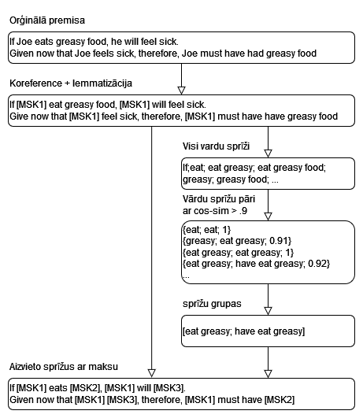

# VTP LPD (12. grupa)
**Autori:**  
Haralds Upītis (hu21001),  
Paulis Kristofers Siks (ps21049)

## Izvēlētā tēma, tās saistība ar valodu tehnoloģijām (0-2 punkti)
### Izvēlētā tēma:
**Loģikas "kļūdu" noteikšana​**

### Saistība ar valodu tehnoloģijām:
Izvēlētā tēma ir fundamentāli saistīta ar valodu tehnoloģijām un valodniecību, jo ievade ir jebkāds cilvēkam lasāms teksts angļu valodā, un mērķis ir klasificēt teikumā esošo loģisko kļūdu.

## Īss pārskats par jomā paveikto, jaunākie sasniegumi (0-2 punkti)
### Aktuālie dokumenti:
https://arxiv.org/pdf/2202.13758 <-- Dokuments, kuru izmantojām par pamatu mūsu risinājumam.  
https://arxiv.org/pdf/2301.11879  
https://arxiv.org/pdf/2405.02318  

Visos dokumentos izmantojot zero-shot klasifikatorus, bez fine-tuning, rezultāti modeļiem ir ~≤30%, ar fine-tuning ~≤70%.
Izmantojot few-shot klasifikatorus, ar fine-tuning rezultāti ir daudz labāki, pat ~≥90%.

## Prototips: demonstrācija, novērtēšana, datu un koda pieejamība (0-4 punkti)
### Process:
Kopā izmantojām 13 loģisko kļūdu marķējumus (labels), kuri apskatāmi 'Data/mappings.json' failā:
```json
{
    "ad hominem": "[MSK1] is claiming [MSK2]. [MSK1] is a moron. Therefore, [MSK2] is not true.",
    "ad populum": "A lot of people believe [MSK1]. Therefore, [MSK1] must be true.",
    "appeal to emotion": "[MSK1] is made without evidence. In place of evidence, emotion is used to convince the interlocutor that [MSK1] is true.",
    "circular reasoning": "[MSK1] is true because of [MSK2]. [MSK2] is true because of [MSK1].",
    "equivocation": "[MSK1] is used to mean [MSK2] in the premise. [MSK1] is used to mean [MSK3] in the conclusion.",
    "fallacy of credibility": "[MSK1] claims that [MSK2]. [MSK1] are experts in the field concerning [MSK2]. Therefore, [MSK2] should be believed.",
    "fallacy of extension": "[MSK1] makes claim [MSK2]. [MSK3] restates [MSK2] (in a distorted way). [MSK3] attacks the distorted version of [MSK2]. Therefore, [MSK2] is false.",
    "fallacy of logic": "If [MSK1] is true, then [MSK2] is true. [MSK2] is true. Therefore, [MSK1] is true.",
    "fallacy of relevance": "It is claimed that [MSK1] implies [MSK2], whereas [MSK1] is unrelated to [MSK2].",
    "false causality": "[MSK1] occurred, then [MSK2] occurred. Therefore, [MSK1] caused [MSK2].",
    "false dilemma": "Either [MSK1] or [MSK2] is true.",
    "faulty generalization": "[MSK1] has attribute [MSK2]. [MSK1] is a subset of [MSK3]. Therefore, all [MSK3] has attribute [MSK2].",
    "intentional": "[MSK1] knows [MSK2] is incorrect. [MSK1] still claim that [MSK2] is correct using an incorrect argument."
  }
```
Izmantotie ievades dati tika ņemti no [saite uz izmantoto datu kopu](https://github.com/tmakesense/logical-fallacy/blob/main/dataset-fixed/edu_all_fixed.csv). Tie ir pamatdokumenta dati, kuri ir pārveidoti un uzlaboti, labojot dažus oriģināldatu [(saite uz oriģināldatiem)](https://github.com/causalNLP/logical-fallacy/blob/main/data/edu_all.csv) defektus [(apraksts par labojumiem)](https://www.logical-fallacy.com/articles/dataset-review/).
### Izmantotās datu kopas piemērs:
```csv
updated_label,original_url,old_label,source_article,explanations,rationale
faulty generalization,https://quizizz.com/admin/quiz/5f948dcbedafcd001e0c5506/logical-fallacies,hasty generalization,"""Annie must like Starbucks because all white girls like Starbucks.""",,
...
...
```
Tad ievades datu kopā `updated_label` kolonā esošās loģiskās kļūdas tiek aizstātas ar attiecīgo mapping.
### Mapped datu kopas piemērs:
```csv
updated_label,original_url,old_label,source_article,explanations,rationale
"[MSK1] has attribute [MSK2]. [MSK1] is a subset of [MSK3]. Therefore, all [MSK3] has attribute [MSK2].","https://quizizz.com/admin/quiz/5f948dcbedafcd001e0c5506/logical-fallacies","hasty generalization","""Annie must like Starbucks because all white girls like Starbucks.""","",""
...
...
```
Tālāk visi kolonā `source_article` esošie teikumi tika aizmaskēti pēc zemāk redzāmās diagrammas principa.



### Maskētās datu kopas piemērs:
```csv
updated_label,source_article
[MSK1] has attribute [MSK2]. [MSK1] is a subset of [MSK3]. Therefore, all [MSK3] has attribute [MSK2]., Masked text: Annie must [MSK2] [MSK1] because all white girls [MSK2] [MSK1]. 
...
...
```

Tad no maskētās datu kopa kolonas `source_article` tiek padoti maskētie teikumi zero-shot klasifikatoram, kurš mēģina noteikt dotajam teikumam atbilstošako marķējumu no visiem 13 marķējumiem.
```csv
Enter a text to classify: Annie must like Starbucks because all white girls like Starbucks.

Masked text: Annie must [MSK2] [MSK1] because all white girls [MSK2] [MSK1]. 

Prediction: [MSK1] is true because of [MSK2]. [MSK2] is true because of [MSK1].
```

### Mūsu rezultāti:
### nli-distilroberta-base klasifikatora rezultāti:
```txt
0
"                        precision    recall  f1-score   support

            ad hominem       0.30      0.23      0.26       264
            ad populum       0.87      0.13      0.23       207
     appeal to emotion       0.00      0.00      0.00       156
    circular reasoning       0.14      0.60      0.23       159
          equivocation       0.02      0.11      0.04        47
fallacy of credibility       0.42      0.08      0.13       126
  fallacy of extension       0.10      0.07      0.08       115
      fallacy of logic       0.06      0.21      0.10       144
  fallacy of relevance       0.08      0.19      0.11       147
       false causality       0.31      0.24      0.27       189
         false dilemma       0.67      0.02      0.03       126
 faulty generalization       0.48      0.03      0.05       399
           intentional       0.00      0.00      0.00       131

              accuracy                           0.15      2210
             macro avg       0.27      0.15      0.12      2210
          weighted avg       0.32      0.15      0.13      2210
"
```


### distilbert-base-uncased-mnli klasifikatora rezultāti:
```txt
0
"                        precision    recall  f1-score   support

            ad hominem       0.11      0.01      0.01       264
            ad populum       0.78      0.10      0.18       207
     appeal to emotion       0.00      0.00      0.00       156
    circular reasoning       0.07      0.18      0.10       159
          equivocation       0.02      0.15      0.04        47
fallacy of credibility       0.41      0.12      0.18       126
  fallacy of extension       0.06      0.38      0.10       115
      fallacy of logic       0.16      0.26      0.20       144
  fallacy of relevance       0.04      0.01      0.02       147
       false causality       0.37      0.21      0.27       189
         false dilemma       0.00      0.00      0.00       126
 faulty generalization       0.30      0.07      0.11       399
           intentional       0.07      0.10      0.08       131

              accuracy                           0.11      2210
             macro avg       0.18      0.12      0.10      2210
          weighted avg       0.22      0.11      0.11      2210
"
```


## Prezentācija un atbildes uz jautājumiem (0-2 punkti)
### Links uz prezentāciju:
...
